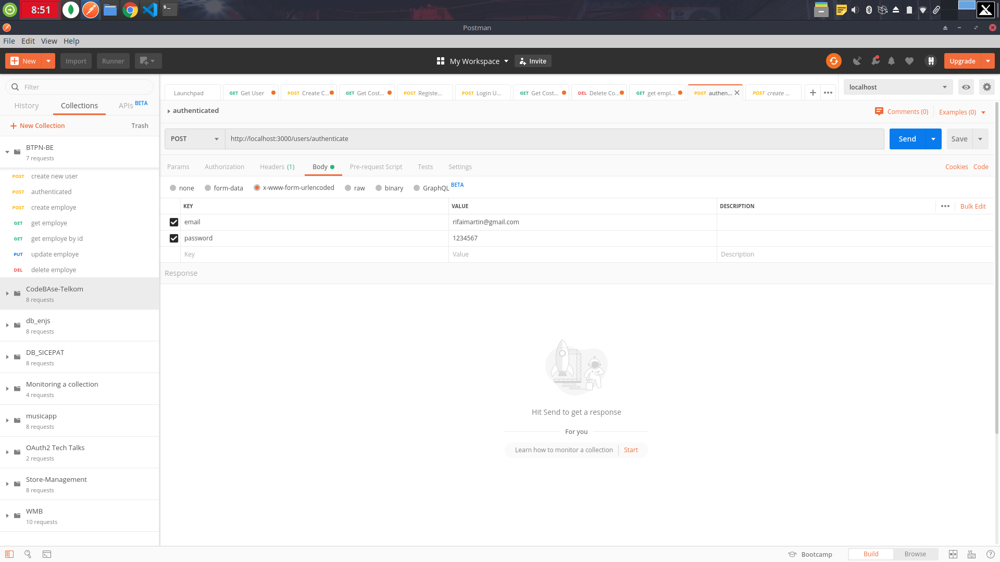

## Requirements
* Node, NPM & MongoDB

## Join Workspace Postman BTPN TEST example Payload
* Join my Workspace ```https://app.getpostman.com/join-team?invite_code=87962b850a089cd0bc0fd7f2ae11e50f ```

## Postman Screnshoot



## Installation
* Clone this repo: ``` git clone https://git.enigmacamp.com/btpn-jenius/muhammad-rifai/muhammad-rifai-be.git ```
* Install dependecies: ``` npm install ```
* Install nodemon: ``` npm install nodemon -g ```
* Running Backend ``` nodemon server.js ```

 

